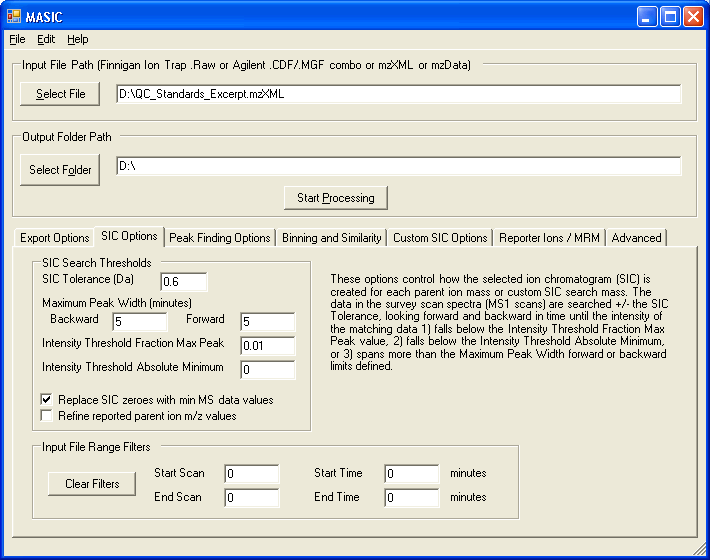
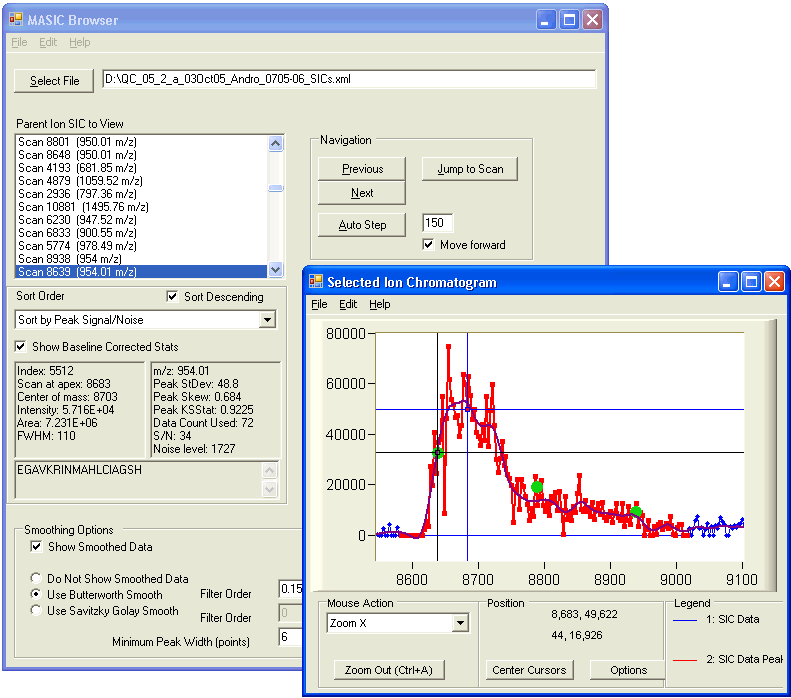

# __MASIC__
MASIC (MS/MS Automated Selected Ion Chromatogram generator) Generates selected ion chromatograms (SICs) for all of the parent ions chosen for fragmentation in an LC-MS/MS analysis.

### Description
The SICs are generated using the LC-MS data, then each SIC is processed using a peak finding algorithm to characterize the chromatographic peaks, providing peak statistics including elution time of the peak apex, peak area, and peak signal/noise.

MASIC can read Finnigan .Raw files, mzXML files, mzData files or .cdf/.mgf combo files. Results are outputted both as flat files (.txt) and in an XML file that can be read using the accompanying graphical results browser. The browser provides a fast, graphical method for browsing the SICs identified by MASIC, allowing the user to sort and filter the SIC list as desired. MASIC has been in routine use in the PRISM pipeline since 2004 and has been used to process over 40,000 datasets. MASIC has also been updated to provide basic support for MRM datasets.

In order to process Thermo .Raw files, you may need to install Thermo's MSFileReader, accessible by creating an account at [https://thermo.flexnetoperations.com/control/thmo/login](https://thermo.flexnetoperations.com/control/thmo/login), then logging in and choosing "Utility Software". When installing enable both features:

* MSFileReader for 64 bit
* MSFileReader for 32 bit

### Related Publications
[MASIC: a software program for fast quantitation and flexible visualization of chromatographic profiles from detected LC-MS(/MS) features.](https://pubmed.ncbi.nlm.nih.gov/18440872/)

### Downloads
* [Latest version](https://github.com/PNNL-Comp-Mass-Spec/MASIC/releases/latest)
* [Source code on GitHub](https://github.com/PNNL-Comp-Mass-Spec/MASIC)
* [Example Data](https://github.com/PNNL-Comp-Mass-Spec/MASIC/tree/master/ExampleData)

#### Software Instructions
The MASIC user interface allows you to customize the processing options for generating selected ion chromatograms, exporting raw data, etc.

The MASIC Results Browser displays a list of the Selected Ion Chromatograms (SICs) generated by the software. You can sort the list and view individual SICs. The green dots indicate the spectra in which this m/z was chosen for MS/MS analysis.

### Acknowledgment

All publications that utilize this software should provide appropriate acknowledgement to PNNL and the MASIC GitHub repository. However, if the software is extended or modified, then any subsequent publications should include a more extensive statement, as shown in the Readme file for the given application or on the website that more fully describes the application.

### Disclaimer

These programs are primarily designed to run on Windows machines. Please use them at your own risk. This material was prepared as an account of work sponsored by an agency of the United States Government. Neither the United States Government nor the United States Department of Energy, nor Battelle, nor any of their employees, makes any warranty, express or implied, or assumes any legal liability or responsibility for the accuracy, completeness, or usefulness or any information, apparatus, product, or process disclosed, or represents that its use would not infringe privately owned rights.

Portions of this research were supported by the NIH National Center for Research Resources (Grant RR018522), the W.R. Wiley Environmental Molecular Science Laboratory (a national scientific user facility sponsored by the U.S. Department of Energy's Office of Biological and Environmental Research and located at PNNL), and the National Institute of Allergy and Infectious Diseases (NIH/DHHS through interagency agreement Y1-AI-4894-01). PNNL is operated by Battelle Memorial Institute for the U.S. Department of Energy under contract DE-AC05-76RL0 1830.

We would like your feedback about the usefulness of the tools and information provided by the Resource. Your suggestions on how to increase their value to you will be appreciated. Please e-mail any comments to proteomics@pnl.gov
